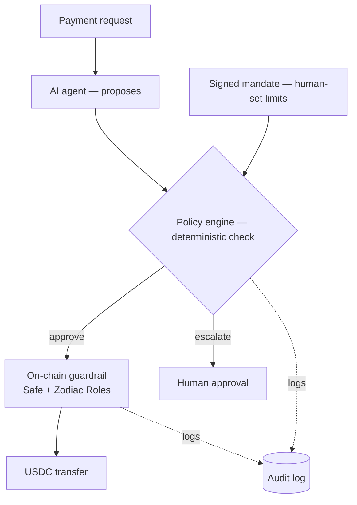

# Lance

**A verifiable authorization layer for autonomous stablecoin payments — where theft is structurally impossible, even if the agent is compromised.**

Lance sits between a probabilistic AI agent and deterministic money movement. A human signs a spend *mandate*; an agent *proposes* payments; a deterministic policy engine *decides*; and an on-chain guardrail *enforces* — independently, so that a leaked key, a prompt injection, or a logic bug cannot move funds anywhere they weren't pre-authorized to go.

---

## Why this exists

The industry spent the last year building *rails* for agent payments. The rails are largely solved. What isn't solved is the layer on top: the **trust, risk, and accountability** boundary between a non-deterministic agent and irreversible money.

That gap is the hard part, because the two sides are fundamentally mismatched. An LLM is probabilistic; a payment is final. You cannot make the model reliable enough to be trusted with unbounded authority, so the authority itself has to be bounded, deterministically, and enforced somewhere the model can't reach.

Lance is that layer. Its wager is simple: **the LLM never touches the execution path.** It reasons and proposes. Everything that can move money is deterministic code and on-chain enforcement.

---

## Core design principle

> **Build the cage before the animal.**

The safety guarantees were built and proven *before* any non-deterministic component was introduced. Enforcement is layered — defense in depth — so no single failure is catastrophic:

- **Agent (soft):** proposes payments. Holds no keys. Can be wrong.
- **Policy engine (medium):** pure, deterministic. Rejects anything outside the signed mandate.
- **On-chain guardrail (hard):** Safe + Zodiac Roles. Enforces the same constraints on-chain, independently — the executor key is **destination-locked** to a whitelist and cannot call anything else.
- **Owner multisig (override):** can disable the module instantly. Kill switch and escalation path in one.

The property that matters: even a *fully compromised* agent — leaked key, injected prompt, broken logic — can at worst bounce funds between pre-approved destinations. It can never exfiltrate the treasury, because the on-chain guardrail doesn't trust the agent at all.

---

## Architecture



The six components:

1. **Mandate** — an EIP-712 signed object created once by the human/multisig: allowed payees (whitelist), per-transaction cap, per-period cap with an explicit period window, allowed token, expiry. The cryptographic capture of human intent.
2. **Agent** — reasons over a request and emits a schema-validated proposal. No keys, no chain access. *(Phase 4 — planned.)*
3. **Policy engine** — pure, deterministic `(proposal, mandate, periodSpendSoFar) → decision` (approve / reject / escalate), always with a machine-readable reason. No I/O, fully unit-testable.
4. **On-chain guardrail** — Safe + Zodiac Roles on Ethereum Sepolia. Executor scoped to USDC `transfer` only, to whitelisted destinations only, within caps. `approve` is blocked.
5. **Escalation path** — anything outside the mandate surfaces for human approval before execution.
6. **Audit layer** — a hash-chained, tamper-evident log binding proposal → decision → on-chain tx, and the source of truth for period spend. *(Phase 3 — planned.)*

---

## Safety, proven on-chain

The guardrail isn't asserted — it's demonstrated against live-deployed contracts on Ethereum Sepolia. "Reverted" alone is weak evidence, so each block was decoded directly: every one is a `ConditionViolation` raised by Zodiac Roles itself, with the correct status *per rule*. The boundary cases (a transfer at exactly the cap succeeds; one unit over reverts) are what prove the guard **discriminates** rather than failing uniformly.

| Adversarial case | Result | Roles status |
|---|---|---|
| ADV-C01 — transfer to non-whitelisted address | **revert** | `ParameterNotAllowed` |
| ADV-C02 — transfer to whitelisted, within cap | success | — |
| ADV-C03 — transfer above per-tx cap | **revert** | `ParameterGreaterThanAllowed` |
| ADV-C04 — transfer at exactly the cap | success | — |
| ADV-C05 — `approve()` to whitelisted spender | **revert** | `FunctionNotAllowed` |
| ADV-C06 — call to a non-USDC contract | **revert** | scoped-target block |
| ADV-C07 — `approve()` to rogue spender | **revert** | `FunctionNotAllowed` |
| ADV-C08 — raw `approve` selector bytes | **revert** | function allow-list block |
| ADV-C09 — zero-amount transfer | **revert** | cap / zero-check |

These run against the actually-deployed proxy, not a mock and not a fork. Destination-locking is real on a live chain.

---

## Tech stack

- **Language:** TypeScript (strict), pnpm
- **Chain:** Ethereum Sepolia (`chainId 11155111`) — testnet only
- **Custody & enforcement:** [Safe](https://safe.global) protocol-kit + [Zodiac Roles Modifier](https://github.com/gnosisguild/zodiac-modifier-roles) (EIP-1167 proxy → canonical 2.1.1 mastercopy)
- **Chain interaction:** viem
- **Validation:** zod (runtime + compile-time schemas)
- **Tests:** Vitest — pure-layer unit + adversarial suites, plus on-chain adversarial tests

The Roles mastercopy address is sourced from the vendor registry (`@gnosis-guild/zodiac`) and verified on-chain before use — never a hardcoded literal. See [ADR 0002](docs/adr/0002-roles-mastercopy-proxy-deployment.md).

---

## Repository layout

```
src/types     core schemas + runtime validation (Mandate, PaymentProposal, PolicyDecision, AuditRecord)
src/mandate   EIP-712 mandate signing & verification
src/policy    the deterministic policy engine
src/chain     Safe + Zodiac Roles integration, viem adapter (chain deps isolated here)
scripts       deploy + live-payment scripts
tests         unit, adversarial, and on-chain (ADV-C) suites
docs/adr      architecture decision records
```

The pure layers (`types`, `policy`, `mandate`) never import chain libraries — this keeps their tests fast and enforces the architectural boundary.

---

## Quickstart

Requires Node 20+, pnpm, and a funded Ethereum Sepolia key for deployment.

```bash
pnpm install
pnpm approve-builds        # approve native build scripts (pnpm blocks them by default)

pnpm exec vitest run       # run the full suite (pure + adversarial)
```

To deploy the guardrail yourself:

```bash
cp .env.example .env       # then set SIGNER_PRIVATE_KEY, EXECUTOR_PRIVATE_KEY,
                           # WHITELIST, PER_TX_CAP_BASE_UNITS, RPC_URL
pnpm deploy                # deploys Safe + Roles proxy, verifies mastercopy on-chain,
                           # configures the executor role, writes deployment.json
pnpm run test:chain        # runs the ADV-C adversarial suite against your deployment
```

The deploy is resumable: if it's interrupted mid-run, re-running adopts the existing proxy (asserting it has code) and skips already-completed steps rather than paying for duplicates.

---

## Deployed contracts (Ethereum Sepolia)

Addresses and transaction hashes are recorded in [`deployment.json`](deployment.json).

| Component | Address |
|---|---|
| Safe | `0xe88Aeb87FE9Dc5306Ee1D7F9f06eF56bBfE27812` |
| Roles Modifier (proxy) | `0x439874DfeEAC829d9161c6f535b14Ee4C60136D6` |
| Signer | `0x6C3d1D0A93A1A9A572310CbF4b54e3d2fE9C42E8` |
| Executor | `0xA045E05B40c7e523F8E6D8f2430dA0c6c97f35da` |
| USDC (Sepolia) | `0x1c7D4B196Cb0C7B01d743Fbc6116a902379C7238` |

---

## Design decisions

Key decisions are recorded as ADRs in [`docs/adr`](docs/adr):

- **0001** — Zodiac SDK choice (self-contained `zodiac-roles-sdk`, no external API-key dependency in the safety-critical path).
- **0002** — Roles mastercopy proxy deployment: why direct bytecode deploy is impossible (Roles runtime is 25,286 bytes, over the EIP-170 24,576-byte limit), the EIP-1167 proxy + registry-sourced mastercopy pattern, on-chain verification, and the move to Ethereum Sepolia after discovering the vendor's Base Sepolia Packer library is undeployed.
